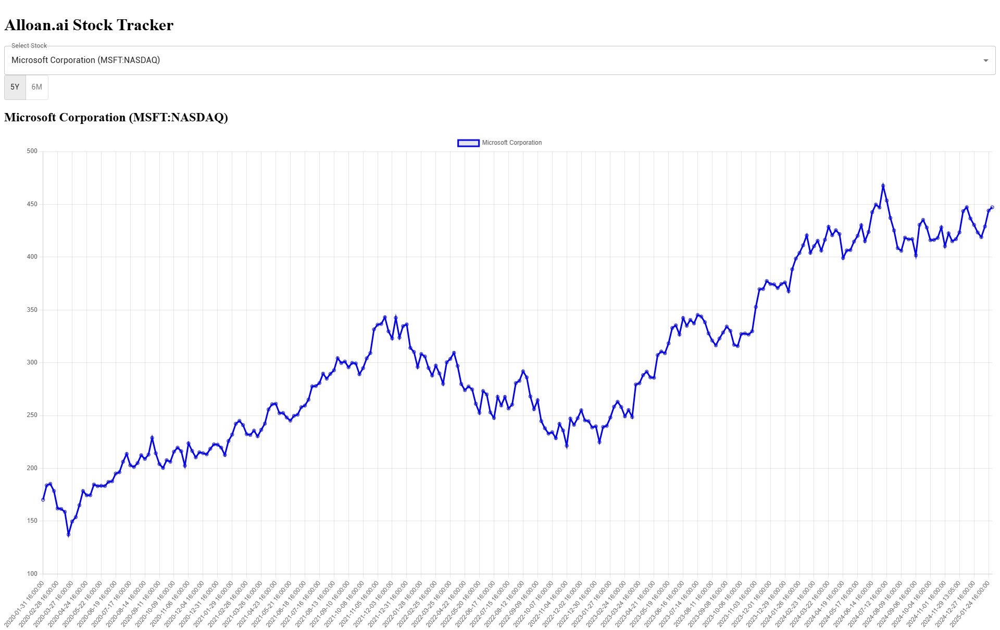
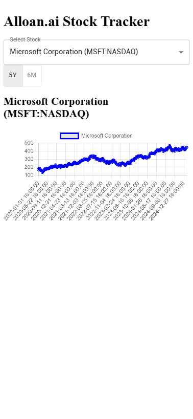

# 📈 Alloan.ai Stock Tracker

This is a stock tracking application built using React, Redux Toolkit, and Chart.js. The app allows users to select stocks, choose a duration, and view dynamic stock price graphs.

## 🚀 Live Demo

[Deployed Application](https://allloan-ai.vercel.app/)

## 🖼️ Screenshots

  
  
  

## 🛠️ Features

- 📊 **Stock Selection**: Choose stocks from a dropdown menu.
- ⏳ **Duration Switcher**: Toggle between different time durations.
- 📉 **Dynamic Stock Graph**: View real-time stock prices on an interactive chart.
- ⚡ **Redux Toolkit**: Efficient state management.
- 🌐 **API Integration**: Fetches stock data from a backend service.

## 🏗️ Tech Stack

- **Frontend**: React, Redux Toolkit, MUI (Material UI), Chart.js
- **Backend**: Django REST Framework (provided API)
- **Deployment**: Render.com

## 📦 Installation & Setup

1. Clone the repository:

   ```sh
   git clone https://github.com/Ashish-Kumar16/Allloan.ai.git
   cd Frontend
   ```

2. Install dependencies:

   ```sh
   npm install
   ```

3. Start the development server:

   ```sh
   npm start
   ```

4. Open `http://localhost:3000` in your browser.

## 🛠️ API Configuration

The application fetches stock data from:

```sh
https://allloan-ai.onrender.com/api/stocks
```

Ensure the backend is running or replace it with your API.

## 🤝 Contributing

1. Fork the repository.
2. Create a new branch: `git checkout -b feature-name`
3. Commit your changes: `git commit -m "feat: added new feature"`
4. Push to the branch: `git push origin feature-name`
5. Open a pull request.

